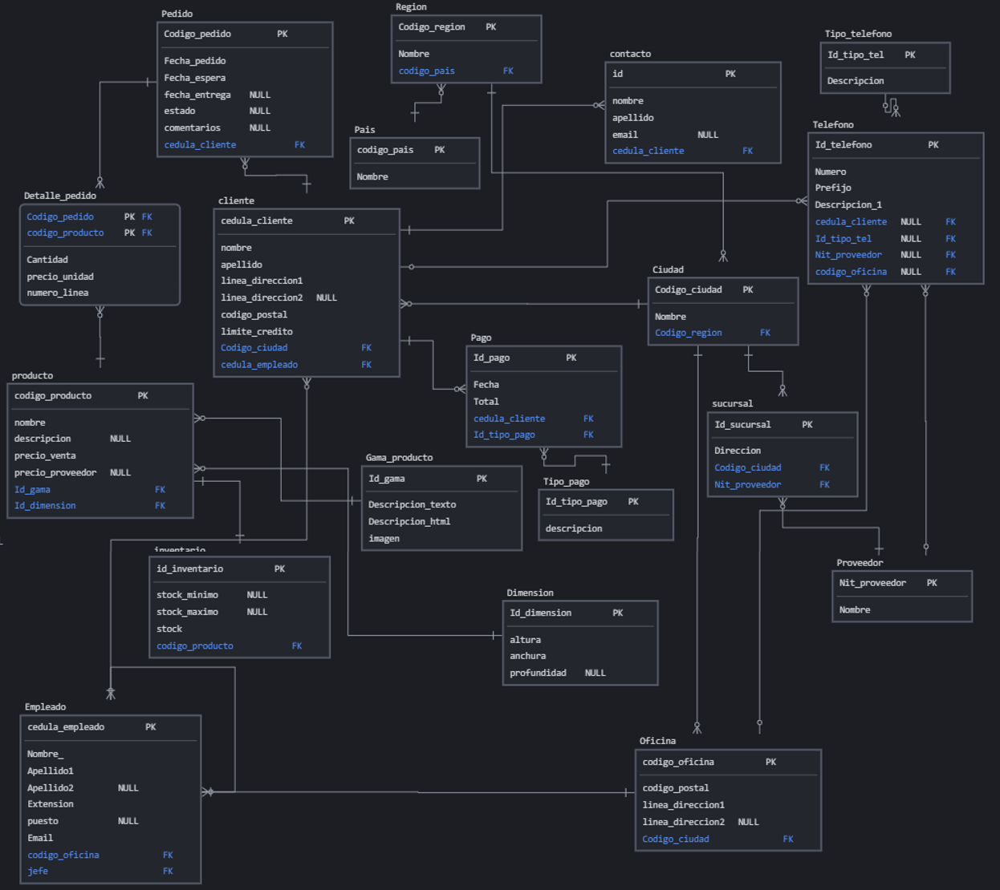

# Taller Normalización

**Creación de la base de datos**

```mysql
CREATE DATABASES taller3;
USE taller3
```

**DER**



**Creación de las tablas**

```mysql
CREATE TABLE pais(
	codigo INT(10) PRIMARY KEY AUTO_INCREMENT,
	nombre VARCHAR(30) NOT NULL);

CREATE TABLE region(
	codigo INT(10) PRIMARY KEY AUTO_INCREMENT,
	nombre VARCHAR(30) NOT NULL,
	codigo_pais INT(10),
	CONSTRAINT FK_regionpais FOREIGN KEY (codigo_pais) REFERENCES pais(codigo));

CREATE TABLE ciudad(
	codigo INT(10) PRIMARY KEY AUTO_INCREMENT,
	nombre VARCHAR(30) NOT NULL,
	codigo_region INT(10),
	CONSTRAINT FK_ciudadregion FOREIGN KEY (codigo_region) REFERENCES region(codigo));

CREATE TABLE tipo_telefono(
	id INT(10) PRIMARY KEY AUTO_INCREMENT,
	descripcion VARCHAR(30) NOT NULL);

CREATE TABLE tipo_pago(
	id INT(10) PRIMARY KEY AUTO_INCREMENT,
	descripcion VARCHAR(30) NOT NULL);

CREATE TABLE proveedor(
	nit VARCHAR(20) PRIMARY KEY,
	nombre VARCHAR(30) NOT NULL);

CREATE TABLE sucursal(
	id INT(10) PRIMARY KEY AUTO_INCREMENT,
	direccion VARCHAR(30) NOT NULL,
	codigo_ciudad INT(10) NOT NULL,
	nit_proveedor VARCHAR(20) NOT NULL,
	CONSTRAINT FK_sucursalciudad FOREIGN KEY (codigo_ciudad) REFERENCES ciudad(codigo),
	CONSTRAINT FK_sucursalproveedor FOREIGN KEY (nit_proveedor) REFERENCES proveedor(nit));

CREATE TABLE gama_producto(
	id INT(10) PRIMARY KEY AUTO_INCREMENT,
	descripcion_texto TEXT NOT NULL,
	descripcion_html TEXT NOT NULL,
	imagen VARCHAR(256) NOT NULL);

CREATE TABLE dimension(
	id INT(10) PRIMARY KEY AUTO_INCREMENT,
	altura VARCHAR(25) NOT NULL,
	anchura VARCHAR(25) NOT NULL,
	profundidad VARCHAR(25));

CREATE TABLE producto(
	codigo INT(10) PRIMARY KEY AUTO_INCREMENT,
	nombre VARCHAR(70) NOT NULL,
	descripcion VARCHAR(25),
	precio_venta DECIMAL(15,2),
	id_gama INT(10) NOT NULL,
	id_dimension INT(10) NOT NULL,	
	nit_proveedor VARCHAR(20) NOT NULL,
	CONSTRAINT FK_productogama FOREIGN KEY (id_gama) REFERENCES gama_producto(id),
	CONSTRAINT FK_productodimen FOREIGN KEY (id_dimension) REFERENCES dimension(id),
	CONSTRAINT FK_sucursalprovee FOREIGN KEY (nit_proveedor) REFERENCES proveedor(nit));

CREATE TABLE oficina(
	codigo INT(10) PRIMARY KEY AUTO_INCREMENT,
	codigo_postal VARCHAR(10) NOT NULL,
	linea_direccion1 VARCHAR(50) NOT NULL,
	linea_direccion2 VARCHAR(50),
	codigo_ciudad INT(10) NOT NULL,
	CONSTRAINT FK_oficinaciudad FOREIGN KEY (codigo_ciudad) REFERENCES ciudad(codigo));


CREATE TABLE inventario(
	id INT(10) PRIMARY KEY AUTO_INCREMENT,
	stock_min SMALLINT(6),
	stock_max SMALLINT(6),
	stock SMALLINT(6) NOT NULL,
	codigo_producto INT(10),
	CONSTRAINT FK_invproducto FOREIGN KEY (codigo_producto) REFERENCES producto(codigo));
	
CREATE TABLE empleado(
	cedula INT(10) PRIMARY KEY,
	nombre VARCHAR(50) NOT NULL,
	apellido1 VARCHAR(30) NOT NULL,
	apellido2 VARCHAR(30),
	extension VARCHAR(10) NOT NULL,
	puesto VARCHAR(50) NOT NULL,
	codigo_oficina INT(10) NOT NULL,
	jefe INT(10),
	email VARCHAR(100) NOT NULL,
	CONSTRAINT FK_empleadoficina FOREIGN KEY (codigo_oficina) REFERENCES oficina(codigo),	
	CONSTRAINT FK_empleadojefe FOREIGN KEY (jefe) REFERENCES empleado(cedula));

	

CREATE TABLE cliente(
	cedula INT(10) NOT NULL PRIMARY KEY,
	nombre VARCHAR(50) NOT NULL,
	linea_direccion1 VARCHAR(30) NOT NULL,
	linea_direccion2 VARCHAR(30) NOT NULL,
	codigo_postal VARCHAR(10),
	limite_credito DECIMAL(15,2),
	cedula_empleado INT(10),
	codigo_ciudad INT(10) NOT NULL,
	CONSTRAINT FK_clientempleado FOREIGN KEY (cedula_empleado) REFERENCES empleado(cedula),
	CONSTRAINT FK_clienteciudad FOREIGN KEY (codigo_ciudad) REFERENCES ciudad(codigo));


CREATE TABLE pedido(
	codigo INT(10) PRIMARY KEY AUTO_INCREMENT,
	fecha_pedido DATE NOT NULL,
	fecha_esperada DATE NOT NULL,
	fecha_entrega DATE,
	estado VARCHAR(15) NOT NULL,
	cedula_cliente INT(10) NOT NULL,
	comentarios TEXT,
	CONSTRAINT FK_pedidocliente FOREIGN KEY (cedula_cliente) REFERENCES cliente(cedula));


CREATE TABLE detalle_pedido(
	codigo_pedido INT(10) NOT NULL,
	codigo_producto INT(10) NOT NULL,
	cantidad INT(11) NOT NULL,
	precio_unidad DECIMAL(15,2) NOT NULL,
	numero_linea SMALLINT(6),
	PRIMARY KEY (codigo_pedido,codigo_producto),
	CONSTRAINT FK_detprodpedido FOREIGN KEY (codigo_pedido) REFERENCES pedido(codigo),	CONSTRAINT FK_detprodprod FOREIGN KEY (codigo_producto) REFERENCES producto(codigo));

CREATE TABLE pago(
	id INT(10) PRIMARY KEY AUTO_INCREMENT,
	fecha DATE NOT NULL,
	total DECIMAL(15,2) NOT NULL,
	cedula_cliente INT(10) NOT NULL,
	id_tipo_pago INT(10) NOT NULL,
	CONSTRAINT FK_pagocliente FOREIGN KEY (cedula_cliente) REFERENCES cliente(cedula),
	CONSTRAINT FK_pago_tipopago FOREIGN KEY (id_tipo_pago) REFERENCES tipo_pago(id));

CREATE TABLE contacto(
	id INT(10) PRIMARY KEY AUTO_INCREMENT,
	nombre VARCHAR(50) NOT NULL,
	apellido VARCHAR(50) NOT NULL,
	email VARCHAR(50),
	cedula_cliente INT(10),
	nit_proveedor VARCHAR(20),
	CONSTRAINT FK_contcliente FOREIGN KEY (cedula_cliente) REFERENCES cliente(cedula),
	CONSTRAINT FK_contprovee FOREIGN KEY (nit_proveedor) REFERENCES proveedor(nit));

CREATE TABLE telefono(
	id INT(10) PRIMARY KEY AUTO_INCREMENT,
	numero INT(10) NOT NULL,
	prefijo VARCHAR(5) NOT NULL,
	cedula_cliente INT(10),
	nit_proveedor VARCHAR(20),
	codigo_oficina INT(10),
	id_tipo_telefono INT(10),
	CONSTRAINT FK_telcliente FOREIGN KEY (cedula_cliente) REFERENCES cliente(cedula),
	CONSTRAINT FK_telprovee FOREIGN KEY (nit_proveedor) REFERENCES proveedor(nit),
	CONSTRAINT FK_teloficina FOREIGN KEY (codigo_oficina) REFERENCES oficina(codigo),
	CONSTRAINT FK_teltipo FOREIGN KEY (id_tipo_telefono) REFERENCES tipo_telefono(id));
```


**Inserción de datos**

```mysql
INSERT INTO pais (nombre) VALUES
('Estados Unidos'),
('Canadá'),
('Australia'),
('Francia'),
('Alemania'),
('Brasil'),
('Japón'),
('China'),
('Italia'),
('España');

INSERT INTO region (nombre, codigo_pais) VALUES
('California', 1),
('Ontario', 2),
('Queensland', 3),
('Île-de-France', 4),
('Baviera', 5),
('São Paulo', 6),
('Tokio', 7),
('Shanghái', 8),
('Lombardía', 9),
('Madrid', 10);

INSERT INTO ciudad (nombre, codigo_region) VALUES
('Los Angeles', 1),
('Toronto', 2),
('Brisbane', 3),
('París', 4),
('Múnich', 5),
('São Paulo', 6),
('Tokio', 7),
('Shanghái', 8),
('Milán', 9),
('Madrid', 10);

INSERT INTO tipo_telefono (descripcion) VALUES
('Móvil'),
('Fijo'),
('Fax'),
('Satelital'),
('VoIP'),
('Público'),
('Privado'),
('IP'),
('Inalámbrico'),
('Virtual');

INSERT INTO tipo_pago (descripcion) VALUES
('Efectivo'),
('Tarjeta de crédito'),
('Transferencia bancaria'),
('Cheque'),
('Criptomoneda'),
('Pago móvil'),
('Letra de cambio'),
('PayPal'),
('Domiciliación bancaria'),
('Orden de pago');

INSERT INTO proveedor (nit, nombre) VALUES
('123456789', 'Proveedor A'),
('987654321', 'Proveedor B'),
('456789123', 'Proveedor C'),
('789123456', 'Proveedor D'),
('321654987', 'Proveedor E'),
('654987321', 'Proveedor F'),
('963258741', 'Proveedor G'),
('147258369', 'Proveedor H'),
('258369147', 'Proveedor I'),
('369147258', 'Proveedor J');

INSERT INTO sucursal (direccion, codigo_ciudad, nit_proveedor) VALUES
('123 Main Street', 1, '123456789'),
('456 Oak Avenue', 2, '987654321'),
('789 Elm Street', 3, '456789123'),
('321 Maple Avenue', 4, '789123456'),
('654 Pine Street', 5, '321654987'),
('987 Cedar Avenue', 6, '654987321'),
('159 Oakwood Drive', 7, '963258741'),
('357 Maplewood Lane', 8, '147258369'),
('753 Cedarwood Court', 9, '258369147'),
('951 Pinewood Road', 10, '369147258');

INSERT INTO gama_producto (descripcion_texto, descripcion_html, imagen) VALUES
('Gama básica', '<p>Gama básica de productos</p>', 'gama_basica.jpg'),
('Gama premium', '<p>Gama premium de productos</p>', 'gama_premium.jpg'),
('Gama estándar', '<p>Gama estándar de productos</p>', 'gama_estandar.jpg'),
('Gama profesional', '<p>Gama profesional de productos</p>', 'gama_profesional.jpg'),
('Gama empresarial', '<p>Gama empresarial de productos</p>', 'gama_empresarial.jpg'),
('Gama deportiva', '<p>Gama deportiva de productos</p>', 'gama_deportiva.jpg'),
('Gama juvenil', '<p>Gama juvenil de productos</p>', 'gama_juvenil.jpg'),
('Gama clásica', '<p>Gama clásica de productos</p>', 'gama_clasica.jpg'),
('Gama vintage', '<p>Gama vintage de productos</p>', 'gama_vintage.jpg'),
('Gama moderna', '<p>Gama moderna de productos</p>', 'gama_moderna.jpg');

INSERT INTO dimension (altura, anchura, profundidad) VALUES
('10cm', '20cm', '30cm'),
('15cm', '25cm', '35cm'),
('12cm', '22cm', '32cm'),
('18cm', '28cm', '38cm'),
('8cm', '18cm', '28cm'),
('11cm', '21cm', '31cm'),
('14cm', '24cm', '34cm'),
('17cm', '27cm', '37cm'),
('9cm', '19cm', '29cm'),
('16cm', '26cm', '36cm');

INSERT INTO producto (nombre, descripcion, precio_venta, id_gama, id_dimension, nit_proveedor) VALUES
('Producto 1', 'Descripción del producto 1', 50.00, 1, 1, '123456789'),
('Producto 2', 'Descripción del producto 2', 100.00, 2, 2, '987654321'),
('Producto 3', 'Descripción del producto 3', 75.00, 3, 3, '456789123'),
('Producto 4', 'Descripción del producto 4', 120.00, 4, 4, '789123456'),
('Producto 5', 'Descripción del producto 5', 85.00, 5, 5, '321654987'),
('Producto 6', 'Descripción del producto 6', 60.00, 6, 6, '654987321'),
('Producto 7', 'Descripción del producto 7', 110.00, 7, 7, '963258741'),
('Producto 8', 'Descripción del producto 8', 95.00, 8, 8, '147258369'),
('Producto 9', 'Descripción del producto 9', 70.00, 9, 9, '258369147'),
('Producto 10', 'Descripción del producto 10', 130.00, 10, 10, '369147258');

INSERT INTO oficina (codigo_postal, linea_direccion1, linea_direccion2, codigo_ciudad) VALUES
('90001', '123 Main Street', '', 1),
('M5V 3A6', '456 Oak Avenue', '', 2),
('4000', '789 Elm Street', '', 3),
('750

01', '321 Maple Avenue', '', 4),
('80331', '654 Pine Street', '', 5),
('01000-000', '987 Cedar Avenue', '', 6),
('150-0002', '159 Oakwood Drive', '', 7),
('200040', '357 Maplewood Lane', '', 8),
('20135', '753 Cedarwood Court', '', 9),
('28001', '951 Pinewood Road', '', 10);

INSERT INTO inventario (stock_min, stock_max, stock, codigo_producto) VALUES
(10, 100, 50, 1),
(5, 50, 30, 2),
(20, 200, 100, 3),
(15, 150, 80, 4),
(8, 80, 45, 5),
(12, 120, 70, 6),
(25, 250, 150, 7),
(18, 180, 110, 8),
(30, 300, 200, 9),
(35, 350, 220, 10);

INSERT INTO empleado (cedula, nombre, apellido1, apellido2, extension, puesto, codigo_oficina, jefe, email) VALUES
(1234567890, 'Juan', 'González', 'Pérez', '101', 'Gerente de Ventas', 1, NULL, 'juan.gonzalez@example.com'),
(2345678901, 'María', 'Rodríguez', 'López', '102', 'Asistente de Ventas', 2, 1234567890, 'maria.rodriguez@example.com'),
(3456789012, 'Carlos', 'Martínez', 'Gómez', '103', 'Vendedor', 3, 1234567890, 'carlos.martinez@example.com'),
(4567890123, 'Ana', 'Hernández', 'Díaz', '104', 'Gerente de Logística', 4, NULL, 'ana.hernandez@example.com'),
(5678901234, 'David', 'Pérez', 'Fernández', '105', 'Asistente de Logística', 5, 4567890123, 'david.perez@example.com'),
(6789012345, 'Laura', 'Gómez', 'Martínez', '106', 'Almacenero', 6, 4567890123, 'laura.gomez@example.com'),
(7890123456, 'Jorge', 'López', 'Hernández', '107', 'Gerente de Compras', 7, NULL, 'jorge.lopez@example.com'),
(8901234567, 'Elena', 'Díaz', 'Pérez', '108', 'Asistente de Compras', 8, 7890123456, 'elena.diaz@example.com'),
(9012345678, 'Miguel', 'Fernández', 'Gómez', '109', 'Comprador', 9, 7890123456, 'miguel.fernandez@example.com'),
(1230123012, 'Sofía', 'Martínez', 'López', '110', 'CEO', 10, NULL, 'sofia.martinez@example.com');

INSERT INTO cliente (cedula, nombre, linea_direccion1, linea_direccion2, codigo_postal, limite_credito, cedula_empleado, codigo_ciudad) VALUES
(1234567890, 'Ana', '123 Main Street', '', '90001', 500.00, 2345678901, 1),
(2345678901, 'Pedro', '456 Oak Avenue', '', 'M5V 3A6', 1000.00, 3456789012, 2),
(3456789012, 'Luis', '789 Elm Street', '', '4000', 750.00, 4567890123, 3),
(4567890123, 'Eva', '321 Maple Avenue', '', '75001', 1200.00, 5678901234, 4),
(5678901234, 'Lucía', '654 Pine Street', '', '80331', 800.00, 6789012345, 5),
(6789012345, 'Mario', '987 Cedar Avenue', '', '01000-000', 1500.00, 7890123456, 6),
(7890123456, 'Sara', '159 Oakwood Drive', '', '150-0002', 600.00, 8901234567, 7),
(8901234567, 'Julia', '357 Maplewood Lane', '', '200040', 1100.00, 9012345678, 8),
(9012345678, 'Pablo', '753 Cedarwood Court', '', '20135', 900.00, 1230123012, 9),
(1230123012, 'Raúl', '951 Pinewood Road', '', '28001', 1300.00, NULL, 10);

INSERT INTO pedido (fecha_pedido, fecha_esperada, fecha_entrega, estado, cedula_cliente, comentarios) VALUES
('2024-04-20', '2024-04-25', NULL, 'Pendiente', 1234567890, 'Urgente'),
('2024-04-19', '2024-04-24', '2024-04-23', 'Entregado', 2345678901, 'Sin comentarios'),
('2024-04-18', '2024-04-23', NULL, 'Pendiente', 3456789012, 'Requiere confirmación'),
('2024-04-17', '2024-04-22', '2024-04-21', 'Entregado', 4567890123, 'Con prioridad'),
('2024-04-16', '2024-04-21', '2024-04-20', 'Entregado', 5678901234, 'Entrega nocturna'),
('2024-04-15', '2024-04-20', NULL, 'Pendiente', 6789012345, 'Envío urgente'),
('2024-04-14', '2024-04-19', NULL, 'Pendiente', 7890123456, 'Con retraso'),
('2024-04-13', '2024-04-18', '2024-04-17', 'Entregado', 8901234567, 'Entrega anticipada'),
('2024-04-12', '2024-04-17', '2024-04-16', 'Entregado', 9012345678, 'Entrega especial'),
('2024-04-11', '2024-04-16', '2024-04-15', 'Entregado', 1230123012, 'Sin comentarios');

INSERT INTO detalle_pedido (codigo_pedido, codigo_producto, cantidad, precio_unidad, numero_linea) VALUES
(1, 1, 2, 25.00, 1),
(2, 2, 1, 100.00, 1),
(3, 3, 3, 25.00, 1),
(4, 4, 1, 120.00, 1),
(5, 5, 2, 42.50, 1),
(6, 6, 1, 60.00, 1),
(7, 7, 4, 27.50, 1),
(8, 8, 1, 95.00, 1),
(9, 9, 2, 35.00, 1),
(10, 10, 1, 130.00, 1);

INSERT INTO pago (fecha, total, cedula_cliente, id_tipo_pago) VALUES
('2024-04-20', 50.00, 1234567890, 1),
('2024-04-19', 100.00, 2345678901, 2),
('2024-04-18', 225.00, 3456789012, 3),
('2024-04-17', 120.00, 4567890123, 4),
('2024-04-16', 85.00, 5678901234, 5),
('2024-04-15', 120.00, 6789012345, 6),
('2024-04-14', 220.00, 7890123456, 7),
('2024-04-13', 270.00, 8901234567, 8),
('2024-04-12', 200.00, 9012345678, 9),
('2024-04-11', 130.00, 1230123012, 10);

INSERT INTO contacto (nombre, apellido, email, cedula_cliente, nit_proveedor) VALUES
('Juan', 'Pérez', 'juan.perez@example.com', 1234567890, NULL),
('María', 'López', 'maria.lopez@example.com', 2345678901, NULL),
('Carlos', 'Gómez', 'carlos.gomez@example.com', 3456789012, NULL),
('Ana', 'Díaz', 'ana.diaz@example.com', 4567890123, NULL),
('David', 'Fernández', 'david.fernandez@example.com', 5678901234, NULL),
('Laura', 'Martínez', 'laura.martinez@example.com', 6789012345, NULL),
('Jorge', 'Hernández', 'jorge.hernandez@example.com', 7890123456, NULL),
('Elena', 'Pérez', 'elena.perez@example.com', 8901234567, NULL),
('Miguel', 'Gómez', 'miguel.gomez@example.com', 9012345678, NULL),
('Sofía', 'López', 'sofia.lopez@example.com', 1230123012, NULL);

INSERT INTO telefono (numero, prefijo, cedula_cliente, nit_proveedor, codigo_oficina, id_tipo_telefono) VALUES
(1234567890, '+1', 1234567890, NULL, NULL, 1),
(2345678901, '+1', 2345678901, NULL, NULL, 2),
(3456789012, '+1', 3456789012, NULL, NULL, 3),
(4567890123, '+1', 4567890123, NULL, NULL, 4),
(5678901234, '+1', 5678901234, NULL, NULL, 5),
(6789012345, '+1', 6789012345, NULL, NULL, 6),
(7890123456, '+1', 7890123456, NULL, NULL, 7),
(8901234567, '+1', 8901234567, NULL, NULL, 8),
(9012345678, '+1', 9012345678, NULL, NULL, 9),
(1230123012, '+1', 1230123012, NULL, NULL, 10);
```


## Consultas sobre una tabla

**1. Devuelve un listado con el código de oficina y la ciudad donde hay oficinas.**

```mysql
SELECT o.codigo, c.nombre AS ciudad
FROM oficina o
JOIN ciudad c ON o.codigo_ciudad = c.codigo;
```

**2. Devuelve un listado con la ciudad y el teléfono de las oficinas de España.**

```mysql
SELECT c.nombre AS ciudad, t.numero, t.prefijo
FROM ciudad c
JOIN oficina o ON c.codigo = o.codigo_ciudad
JOIN telefono t ON o.codigo = t.codigo_oficina
JOIN pais p ON c.codigo_pais = p.codigo
WHERE p.nombre = 'España';
```

**3. Devuelve un listado con el nombre, apellidos y email de los empleados cuyo jefe tiene un código de jefe igual a 7.**

```mysql
SELECT e.nombre, e.apellido1, e.apellido2, e.email
FROM empleado e
WHERE e.jefe = 7;
```

**4. Devuelve el nombre del puesto, nombre, apellidos y email del jefe de la empresa.**

```
SELECT e.puesto, e.nombre, e.apellido1, e.apellido2, e.email
FROM empleado e
WHERE e.cedula = (SELECT jefe FROM empleado WHERE cedula = 1);
```

**5. Devuelve un listado con el nombre, apellidos y puesto de aquellos**
**empleados que no sean representantes de ventas.**

```mysql
SELECT nombre, apellido1, apellido2, puesto
FROM empleado
WHERE puesto != 'Representante de Ventas';
```

**6. Devuelve un listado con el nombre de los todos los clientes españoles.**

```mysql
SELECT c.nombre
FROM cliente c
JOIN ciudad ci ON c.codigo_ciudad = ci.codigo
JOIN region r ON ci.codigo_region=r.codigo
JOIN pais p ON r.codigo_pais = p.codigo
WHERE p.nombre = 'España';
```

**7. Devuelve un listado con los distintos estados por los que puede pasar un**
**pedido.**

```mysql
SELECT DISTINCT estado
FROM pedido;
```

**8. Devuelve un listado con el código de cliente de aquellos clientes que**
**realizaron algún pago en 2008. Tenga en cuenta que deberá eliminar**
**aquellos códigos de cliente que aparezcan repetidos. Resuelva la consulta:**
**• Utilizando la función YEAR de MySQL.**
**• Utilizando la función DATE_FORMAT de MySQL.**
**• Sin utilizar ninguna de las funciones anteriores.**

```mysql
-- Utilizando la función YEAR de MySQL.
SELECT DISTINCT cedula_cliente
FROM pago
WHERE YEAR(fecha) = 2008;

-- Utilizando la función DATE_FORMAT de MySQL.
SELECT DISTINCT cedula_cliente
FROM pago
WHERE DATE_FORMAT(fecha, '%Y') = '2008';

-- Sin utilizar ninguna de las funciones anteriores.
SELECT DISTINCT p.cedula_cliente
FROM pago p
WHERE p.fecha >= '2008-01-01' AND p.fecha <= '2008-12-31';
```

**9. Devuelve un listado con el código de pedido, código de cliente, fecha**
**esperada y fecha de entrega de los pedidos que no han sido entregados a**
**tiempo.**

```mysql
SELECT codigo, cedula_cliente, fecha_esperada, fecha_entrega
FROM pedido
WHERE estado = 'No entregado a tiempo';
```

**10. Devuelve un listado con el código de pedido, código de cliente, fecha**
**esperada y fecha de entrega de los pedidos cuya fecha de entrega ha sido al**
**menos dos días antes de la fecha esperada.**
**• Utilizando la función ADDDATE de MySQL.**
**• Utilizando la función DATEDIFF de MySQL.**
**• ¿Sería posible resolver esta consulta utilizando el operador de suma + oresta -?**

```mysql
-- Utilizando la función ADDDATE de MySQL.
SELECT codigo, cedula_cliente, fecha_esperada, fecha_entrega
FROM pedido
WHERE DATEDIFF(fecha_esperada, fecha_entrega) >= 2;

-- Utilizando la función DATEDIFF de MySQL.
SELECT codigo, cedula_cliente, fecha_esperada, fecha_entrega
FROM pedido
WHERE fecha_entrega < ADDDATE(fecha_esperada, -2);

-- ¿Sería posible resolver esta consulta utilizando el operador de suma + o resta -?
SELECT codigo, cedula_cliente, fecha_esperada, fecha_entrega
FROM pedido
WHERE fecha_entrega < fecha_esperada - INTERVAL 2 DAY;
```

**11. Devuelve un listado de todos los pedidos que fueron rechazados en 2009.**

```mysql
SELECT codigo, fecha_pedido, fecha_esperada, fecha_entrega, estado, cedula_cliente, comentarios
FROM pedido
WHERE estado = 'Rechazado' AND YEAR(fecha_pedido) = 2009;
```

**12. Devuelve un listado de todos los pedidos que han sido entregados en el**
**mes de enero de cualquier año.**

```mysql
SELECT codigo, fecha_pedido, fecha_esperada, fecha_entrega, estado, cedula_cliente, comentarios
FROM pedido
WHERE MONTH(fecha_entrega) = 1;
```

**13. Devuelve un listado con todos los pagos que se realizaron en el**
**año 2008 mediante Paypal. Ordene el resultado de mayor a menor.**

```mysql
SELECT *
FROM pago
WHERE YEAR(fecha) = 2008 AND id_tipo_pago = (SELECT id FROM tipo_pago WHERE descripcion = 'Paypal')
ORDER BY total DESC;
```

**14. Devuelve un listado con todas las formas de pago que aparecen en la tabla pago. Tenga en cuenta que no deben aparecer formas de pago
repetidas.**

```mysql
SELECT DISTINCT id_tipo_pago
FROM pago;
```

**15. Devuelve un listado con todos los productos que pertenecen a la**
**gama Ornamentales y que tienen más de 100 unidades en stock. El listado**
**deberá estar ordenado por su precio de venta, mostrando en primer lugar**
**los de mayor precio.**

```mysql
SELECT p.codigo, p.nombre, p.descripcion, p.precio_venta, p.id_gama, p.id_dimension, p.nit_proveedor
FROM producto p
JOIN gama_producto gp ON p.id_gama = gp.id
JOIN inventario i ON p.codigo = i.codigo_producto
WHERE gp.descripcion_texto = 'Ornamentales' AND i.stock > 100
ORDER BY p.precio_venta DESC;
```

**16. Devuelve un listado con todos los clientes que sean de la ciudad de Madrid y cuyo representante de ventas tenga el código de empleado 11 o 30.**

```mysql
SELECT c.cedula, c.nombre, c.linea_direccion1, c.linea_direccion2, c.codigo_postal, c.limite_credito, c.cedula_empleado, c.codigo_ciudad 
FROM cliente c
JOIN ciudad ci ON c.codigo_ciudad = ci.codigo
JOIN empleado e ON c.cedula_empleado = e.cedula
WHERE ci.nombre = 'Madrid' AND (e.cedula = 11 OR e.cedula = 30);
```


### Consultas multitabla (Composición interna)

**Resuelva todas las consultas utilizando la sintaxis de SQL1 y SQL2. Las consultas con sintaxis de SQL2 se deben resolver con INNER JOIN y NATURAL JOIN.**

1. Obtén un listado con el nombre de cada cliente y el nombre y apellido de su representante de ventas.

```mysql
-- SQL1
SELECT cliente.nombre, empleado.nombre, empleado.apellido1
FROM cliente, empleado
WHERE cliente.cedula_empleado = empleado.cedula;

-- SQL2
SELECT cliente.nombre, empleado.nombre, empleado.apellido1
FROM cliente
INNER JOIN empleado ON cliente.cedula_empleado = empleado.cedula;
```

2. Muestra el nombre de los clientes que hayan realizado pagos junto con el nombre de sus representantes de ventas.

```mysql
-- SQL1
SELECT cliente.nombre, empleado.nombre, empleado.apellido1
FROM cliente, empleado, pago
WHERE cliente.cedula_empleado = empleado.cedula AND cliente.cedula = pago.cedula_cliente;

-- SQL2
SELECT cliente.nombre, empleado.nombre, empleado.apellido1
FROM cliente
INNER JOIN empleado ON cliente.cedula_empleado = empleado.cedula
INNER JOIN pago ON cliente.cedula = pago.cedula_cliente;
```

3. Muestra el nombre de los clientes que no hayan realizado pagos junto con el nombre de sus representantes de ventas.

```mysql
-- SQL1
SELECT cliente.nombre, empleado.nombre, empleado.apellido1
FROM cliente, empleado
WHERE cliente.cedula_empleado = empleado.cedula AND cliente.cedula NOT IN (SELECT cedula_cliente FROM pago);

-- SQL2
SELECT cliente.nombre, empleado.nombre, empleado.apellido1
FROM cliente
INNER JOIN empleado ON cliente.cedula_empleado = empleado.cedula
WHERE cliente.cedula NOT IN (SELECT cedula_cliente FROM pago);
```

4. Devuelve el nombre de los clientes que han hecho pagos y el nombre de sus representantes junto con la ciudad de la oficina a la que pertenece el representante.

```mysql
-- SQL1
SELECT cliente.nombre, empleado.nombre, empleado.apellido1, oficina.ciudad
FROM cliente, empleado, pago, oficina
WHERE cliente.cedula_empleado = empleado.cedula AND cliente.cedula = pago.cedula_cliente AND empleado.codigo_oficina = oficina.codigo;

-- SQL2
SELECT cliente.nombre, empleado.nombre, empleado.apellido1, oficina.ciudad
FROM cliente
INNER JOIN empleado ON cliente.cedula_empleado = empleado.cedula
INNER JOIN pago ON cliente.cedula = pago.cedula_cliente
INNER JOIN oficina ON empleado.codigo_oficina = oficina.codigo;
```

5. Devuelve el nombre de los clientes que no hayan hecho pagos y el nombre de sus representantes junto con la ciudad de la oficina a la que pertenece el representante.

```mysql
-- SQL1
SELECT cliente.nombre, empleado.nombre, empleado.apellido1, oficina.ciudad
FROM cliente, empleado, oficina
WHERE cliente.cedula_empleado = empleado.cedula AND cliente.cedula NOT IN (SELECT cedula_cliente FROM pago) AND empleado.codigo_oficina = oficina.codigo;

-- SQL2
SELECT cliente.nombre, empleado.nombre, empleado.apellido1, oficina.ciudad
FROM cliente
INNER JOIN empleado ON cliente.cedula_empleado = empleado.cedula
INNER JOIN oficina ON empleado.codigo_oficina = oficina.codigo
WHERE cliente.cedula NOT IN (SELECT cedula_cliente FROM pago);
```

6. Lista la dirección de las oficinas que tengan clientes en Fuenlabrada.

```mysql
-- SQL1
SELECT DISTINCT oficina.direccion
FROM oficina, empleado, cliente, ciudad
WHERE empleado.codigo_oficina = oficina.codigo AND cliente.cedula_empleado = empleado.cedula AND cliente.codigo_ciudad = ciudad.codigo AND ciudad.nombre = 'Fuenlabrada';

-- SQL2
SELECT DISTINCT oficina.direccion
FROM oficina
INNER JOIN empleado ON empleado.codigo_oficina = oficina.codigo
INNER JOIN cliente ON cliente.cedula_empleado = empleado.cedula
INNER JOIN ciudad ON cliente.codigo_ciudad = ciudad.codigo
WHERE ciudad.nombre = 'Fuenlabrada';
```

7. Devuelve el nombre de los clientes y el nombre de sus representantes junto con la ciudad de la oficina a la que pertenece el representante.

```mysql
-- SQL1
SELECT cliente.nombre, empleado.nombre, empleado.apellido1, oficina.ciudad
FROM cliente, empleado, oficina
WHERE cliente.cedula_empleado = empleado.cedula AND empleado.codigo_oficina = oficina.codigo;

-- SQL2
SELECT cliente.nombre, empleado.nombre, empleado.apellido1, oficina.ciudad
FROM cliente
INNER JOIN empleado ON cliente.cedula_empleado = empleado.cedula
INNER JOIN oficina ON empleado.codigo_oficina = oficina.codigo;
```

8. Devuelve un listado con el nombre de los empleados junto con el nombre de sus jefes.

```mysql
-- SQL1
SELECT e1.nombre AS empleado, e2.nombre AS jefe
FROM empleado e1, empleado e2
WHERE e1.jefe = e2.cedula;

-- SQL2
SELECT e1.nombre AS empleado, e2.nombre AS jefe
FROM empleado e1
INNER JOIN empleado e2 ON e1.jefe = e2.cedula;
```

9. Devuelve un listado que muestre el nombre de cada empleado, el nombre de su jefe y el nombre del jefe de sus jefe.

```mysql
-- SQL1
SELECT e1.nombre AS empleado, e2.nombre AS jefe, e3.nombre AS jefe_de_jefe
FROM empleado e1, empleado e2, empleado e3
WHERE e1.jefe = e2.cedula AND e2.jefe = e3.cedula;

-- SQL2
SELECT e1.nombre AS empleado, e2.nombre AS jefe, e3.nombre AS jefe_de_jefe
FROM empleado e1
INNER JOIN empleado e2 ON e1.jefe = e2.cedula
INNER JOIN empleado e3 ON e2.jefe = e3.cedula;
```

10. Devuelve el nombre de los clientes a los que no se les ha entregado a tiempo un pedido.

```mysql
-- SQL1
SELECT DISTINCT cliente.nombre
FROM cliente, pedido
WHERE cliente.cedula = pedido.cedula_cliente AND pedido.estado != 'Entregado a tiempo';

-- SQL2
SELECT DISTINCT cliente.nombre
FROM cliente
INNER JOIN pedido ON cliente.cedula = pedido.cedula_cliente
WHERE pedido.estado != 'Entregado a tiempo';
```

11. Devuelve un listado de las diferentes gamas de producto que ha comprado cada cliente.

```mysql
-- SQL1
SELECT DISTINCT cliente.nombre, gama_producto.descripcion_texto
FROM cliente, pedido, detalle_pedido, producto, gama_producto
WHERE cliente.cedula = pedido.cedula_cliente AND pedido.codigo

 = detalle_pedido.codigo_pedido AND detalle_pedido.codigo_producto = producto.codigo AND producto.id_gama = gama_producto.id;

-- SQL2
SELECT DISTINCT cliente.nombre, gama_producto.descripcion_texto
FROM cliente
INNER JOIN pedido ON cliente.cedula = pedido.cedula_cliente
INNER JOIN detalle_pedido ON pedido.codigo = detalle_pedido.codigo_pedido
INNER JOIN producto ON detalle_pedido.codigo_producto = producto.codigo
INNER JOIN gama_producto ON producto.id_gama = gama_producto.id;
```


### Consultas multitabla (Composición externa)

**Resuelva todas las consultas utilizando las cláusulas LEFT JOIN, RIGHT JOIN, NATURAL LEFT JOIN y NATURAL RIGHT JOIN**

**1. Devuelve un listado que muestre solamente los clientes que no han
realizado ningún pago.**

```mysql
SELECT c.cedula, c.nombre, c.linea_direccion1, c.linea_direccion2, c.codigo_postal, c.limite_credito, c.cedula_empleado, c.codigo_ciudad 
FROM cliente c
LEFT JOIN pago p ON c.cedula = p.cedula_cliente
WHERE p.id IS NULL;
```

**2. Devuelve un listado que muestre solamente los clientes que no han
realizado ningún pedido.**

```mysql
SELECT c.cedula, c.nombre, c.linea_direccion1, c.linea_direccion2, c.codigo_postal, c.limite_credito, c.cedula_empleado, c.codigo_ciudad 
FROM cliente c
LEFT JOIN pedido pe ON c.cedula = pe.cedula_cliente
WHERE pe.codigo IS NULL;
```

**3. Devuelve un listado que muestre los clientes que no han realizado ningún pago y los que no han realizado ningún pedido.**

```mysql
SELECT c.cedula, c.nombre, c.linea_direccion1, c.linea_direccion2, c.codigo_postal, c.limite_credito, c.cedula_empleado, c.codigo_ciudad 
FROM cliente c
LEFT JOIN pago p ON c.cedula = p.cedula_cliente
LEFT JOIN pedido pe ON c.cedula = pe.cedula_cliente
WHERE p.id IS NULL AND pe.codigo IS NULL;
```

**4. Devuelve un listado que muestre solamente los empleados que no tienen una oficina asociada.**

```mysql
SELECT e.cedula, e.nombre, e.apellido1, e.apellido2, e.extension, e.puesto, e.codigo_oficina, e.jefe, e.email
FROM empleado e
LEFT JOIN oficina o ON e.codigo_oficina = o.codigo
WHERE o.codigo IS NULL;
```

**5. Devuelve un listado que muestre solamente los empleados que no tienen un cliente asociado.**

```mysql
SELECT e.cedula, e.nombre, e.apellido1, e.apellido2, e.extension, e.puesto, e.codigo_oficina, e.jefe, e.email
FROM empleado e
LEFT JOIN cliente c ON e.cedula = c.cedula_empleado
WHERE c.cedula IS NULL;
```

**6. Devuelve un listado que muestre solamente los empleados que no tienen un cliente asociado junto con los datos de la oficina donde trabajan..**

```mysql
SELECT e.cedula, CONCAT(e.nombre,' ',e.apellido1,' ',e.apellido2) AS 'Nombre Completo', o.codigo, o.codigo_postal, o.linea_direccion1, o.linea_direccion2, o.codigo_ciudad
FROM empleado e
LEFT JOIN cliente c ON e.cedula = c.cedula_empleado
JOIN oficina o ON e.codigo_oficina = o.codigo
WHERE c.cedula IS NULL;
```

**7. Devuelve un listado que muestre los empleados que no tienen una oficina asociada y los que no tienen un cliente asociado.**

```mysql
SELECT e.cedula, CONCAT(e.nombre,' ',e.apellido1,' ',e.apellido2) AS 'Nombre Completo'
FROM empleado e
LEFT JOIN oficina o ON e.codigo_oficina = o.codigo
LEFT JOIN cliente c ON e.cedula = c.cedula_empleado
WHERE o.codigo IS NULL OR c.cedula IS NULL;
```

**8. Devuelve un listado de los productos que nunca han aparecido en un
pedido.**

```mysql
SELECT p.codigo, p.nombre, p.descripcion, p.precio_venta
FROM producto p
LEFT JOIN detalle_pedido dp ON p.codigo = dp.codigo_producto
WHERE dp.codigo_pedido IS NULL;
```

**9. Devuelve un listado de los productos que nunca han aparecido en un
pedido. El resultado debe mostrar el nombre, la descripción y la imagen del
producto.**

```mysql
SELECT p.nombre, p.descripcion, p.imagen
FROM producto p
LEFT JOIN detalle_pedido dp ON p.codigo = dp.codigo_producto
WHERE dp.codigo_pedido IS NULL;
```

**10. Devuelve las oficinas donde no trabajan ninguno de los empleados que hayan sido los representantes de ventas de algún cliente que haya realizado la compra de algún producto de la gama Frutales.**

```mysql
SELECT o.codigo, o.codigo_postal, o.linea_direccion1, o.linea_direccion2, o.codigo_ciudad
FROM oficina o
LEFT JOIN empleado e ON o.codigo = e.codigo_oficina
WHERE e.cedula IS NULL;
```

**11. Devuelve un listado con los clientes que han realizado algún pedido pero no han realizado ningún pago.**

```mysql
SELECT c.cedula, c.nombre, c.linea_direccion1, c.linea_direccion2, c.codigo_postal, c.limite_credito, c.cedula_empleado, c.codigo_ciudad
FROM cliente c
LEFT JOIN pedido pe ON c.cedula = pe.cedula_cliente
LEFT JOIN pago p ON c.cedula = p.cedula_cliente
WHERE pe.codigo IS NOT NULL AND p.id IS NULL;
```

**12. Devuelve un listado con los datos de los empleados que no tienen clientes asociados y el nombre de su jefe asociado.**

```mysql
SELECT e.cedula, CONCAT(e.nombre,' ',e.apellido1,' ',e.apellido2) AS 'Nombre Completo', ej.nombre AS nombre_jefe, ej.apellido1 AS apellido1_jefe
FROM empleado e
LEFT JOIN empleado ej ON e.jefe = ej.cedula
LEFT JOIN cliente c ON e.cedula = c.cedula_empleado
WHERE c.cedula IS NULL;
```


### Consultas resumen

1. **¿Cuántos empleados hay en la compañía?**

```mysql
SELECT COUNT(*) AS total_empleados
FROM empleado;
```

2. **¿Cuántos clientes tiene cada país?**

```mysql
SELECT p.nombre AS pais, COUNT(c.cedula) AS total_clientes
FROM pais p
LEFT JOIN cliente c ON p.codigo = c.codigo_pais
GROUP BY p.nombre;
```

3. **¿Cuál fue el pago medio en 2009?**

```mysql
SELECT AVG(total) AS pago_medio_2009
FROM (
    SELECT YEAR(fecha) AS anio, SUM(total) AS total
    FROM pago
    GROUP BY YEAR(fecha)
) AS pagos_por_anio
WHERE anio = 2009;
```

4. **¿Cuántos pedidos hay en cada estado? Ordena el resultado de forma descendente por el número de pedidos.**

```mysql
SELECT estado, COUNT(*) AS numero_pedidos
FROM pedido
GROUP BY estado
ORDER BY numero_pedidos DESC;
```

5. **Calcula el precio de venta del producto más caro y más barato en una misma consulta.**

```mysql
SELECT MAX(precio_venta) AS precio_mas_caro, MIN(precio_venta) AS precio_mas_barato
FROM producto;
```

6. **Calcula el número de clientes que tiene la empresa.**

```mysql
SELECT COUNT(*) AS total_clientes
FROM cliente;
```

7. **¿Cuántos clientes existen con domicilio en la ciudad de Madrid?**

```mysql
SELECT COUNT(*) AS clientes_en_madrid
FROM cliente c
JOIN ciudad ci ON c.codigo_ciudad = ci.codigo
WHERE ci.nombre = 'Madrid';
```

8. **¿Calcula cuántos clientes tiene cada una de las ciudades que empiezan por M?**

```mysql
SELECT ci.nombre AS ciudad, COUNT(c.cedula) AS total_clientes
FROM cliente c
JOIN ciudad ci ON c.codigo_ciudad = ci.codigo
WHERE ci.nombre LIKE 'M%'
GROUP BY ci.nombre;
```

9. **Devuelve el nombre de los representantes de ventas y el número de clientes al que atiende cada uno.**

```mysql
SELECT e.nombre, e.apellido1, COUNT(c.cedula) AS clientes_atendidos
FROM empleado e
LEFT JOIN cliente c ON e.cedula = c.cedula_empleado
GROUP BY e.nombre, e.apellido1;
```

10. **Calcula el número de clientes que no tiene asignado representante de ventas**.

```mysql
SELECT COUNT(*) AS clientes_sin_representante
FROM cliente
WHERE cedula_empleado IS NULL;
```

11. **Calcula la fecha del primer y último pago realizado por cada uno de los clientes. El listado deberá mostrar el nombre y los apellidos de cada cliente.**

```mysql
SELECT c.nombre, c.apellido1, c.apellido2,
       MIN(p.fecha) AS primer_pago,
       MAX(p.fecha) AS ultimo_pago
FROM cliente c
LEFT JOIN pago p ON c.cedula = p.cedula_cliente
GROUP BY c.nombre, c.apellido1, c.apellido2;
```

12. **Calcula el número de productos diferentes que hay en cada uno de los pedidos.**

```mysql
SELECT codigo_pedido, COUNT(codigo_producto) AS productos_diferentes
FROM detalle_pedido
GROUP BY codigo_pedido;
```

13. **Calcula la suma de la cantidad total de todos los productos que aparecen en cada uno de los pedidos.**

```mysql
SELECT codigo_pedido, SUM(cantidad) AS cantidad_total
FROM detalle_pedido
GROUP BY codigo_pedido;
```

14. **Devuelve un listado de los 20 productos más vendidos y el número total de unidades que se han vendido de cada uno. El listado deberá estar ordenado por el número total de unidades vendidas.**

```mysql
SELECT dp.codigo_producto, p.nombre, SUM(dp.cantidad) AS total_unidades_vendidas
FROM detalle_pedido dp
JOIN producto p ON dp.codigo_producto = p.codigo
GROUP BY dp.codigo_producto
ORDER BY total_unidades_vendidas DESC
LIMIT 20;
```

15. **La facturación que ha tenido la empresa en toda la historia, indicando la base imponible, el IVA y el total facturado. La base imponible se calcula sumando el coste del producto por el número de unidades vendidas de la tabla detalle_pedido. El IVA es el 21 % de la base imponible, y el total la suma de los dos campos anteriores.**

```mysql
SELECT SUM(dp.cantidad * p.precio_venta) AS base_imponible,
       SUM(dp.cantidad * p.precio_venta) * 0.21 AS IVA,
       SUM(dp.cantidad * p.precio_venta) + (SUM(dp.cantidad * p.precio_venta) * 0.21) AS total_facturado
FROM detalle_pedido dp
JOIN producto p ON dp.codigo_producto = p.codigo;
```

16. **La misma información que en la pregunta anterior, pero agrupada por código de producto.**

```mysql
SELECT dp.codigo_producto,
       SUM(dp.cantidad * p.precio_venta) AS base_imponible,
       SUM(dp.cantidad * p.precio_venta) * 0.21 AS IVA,
       SUM(dp.cantidad * p.precio_venta) + (SUM(dp.cantidad * p.precio_venta) * 0.21) AS total_facturado
FROM detalle_pedido dp
JOIN producto p ON dp.codigo_producto = p.codigo
GROUP BY dp.codigo_producto;
```

17. **La misma información que en la pregunta anterior, pero agrupada por código de producto filtrada por los códigos que empiecen por OR.**

```mysql
SELECT dp.codigo_producto,
       SUM(dp.cantidad * p.precio_venta) AS base_imponible,
       SUM(dp.cantidad * p.precio_venta) * 0.21 AS IVA,
       SUM(dp.cantidad * p.precio_venta) + (SUM(dp.cantidad * p.precio_venta) * 0.21) AS total_facturado
FROM detalle_pedido dp
JOIN producto p ON dp.codigo_producto = p.codigo
WHERE p.codigo LIKE 'OR%'
GROUP BY dp.codigo_producto;
```

18. **Lista las ventas totales de los productos que hayan facturado más de 3000 euros. Se mostrará el nombre, unidades vendidas, total facturado y total facturado con impuestos (21% IVA).**

```mysql
SELECT p.nombre,
       SUM(dp.cantidad) AS unidades_vendidas,
       SUM(dp.cantidad * p.precio_venta) AS total_facturado,
       (SUM(dp.cantidad * p.precio_venta) * 0.21) AS total_iva,
       SUM(dp.cantidad * p.precio_venta) + (SUM(dp.cantidad * p.precio_venta) * 0.21) AS total_con_iva
FROM detalle_pedido dp
JOIN producto p ON dp.codigo_producto = p.codigo
GROUP BY p.nombre
HAVING total_facturado > 3000;
```

19. **Muestre la suma total de todos los pagos que se realizaron para cada uno de los años que aparecen en la tabla pagos.**

```mysql
SELECT YEAR(fecha) AS año, SUM(total) AS suma_total_pagos
FROM pago
GROUP BY YEAR(fecha);
```


### Consultas variadas

1. **Devuelve el listado de clientes indicando el nombre del cliente y cuántos pedidos ha realizado. Tenga en cuenta que pueden existir clientes que no han realizado ningún pedido.**

```mysql
SELECT c.nombre, COUNT(p.codigo) AS pedidos_realizados
FROM cliente c
LEFT JOIN pedido p ON c.cedula = p.cedula_cliente
GROUP BY c.nombre;
```

2. **Devuelve un listado con los nombres de los clientes y el total pagado por cada uno de ellos. Tenga en cuenta que pueden existir clientes que no han realizado ningún pago.**

```mysql
SELECT c.nombre, COALESCE(SUM(p.total), 0) AS total_pagado
FROM cliente c
LEFT JOIN pago p ON c.cedula = p.cedula_cliente
GROUP BY c.nombre;
```

3. **Devuelve el nombre de los clientes que hayan hecho pedidos en 2008 ordenados alfabéticamente de menor a mayor.**

```mysql
SELECT DISTINCT c.nombre
FROM cliente c
JOIN pedido p ON c.cedula = p.cedula_cliente
WHERE YEAR(p.fecha_pedido) = 2008
ORDER BY c.nombre ASC;
```

4. **Devuelve el nombre del cliente, el nombre y primer apellido de su representante de ventas y el número de teléfono de la oficina del representante de ventas, de aquellos clientes que no hayan realizado ningún pago.**

```mysql
SELECT c.nombre AS cliente, e.nombre AS nombre_representante, e.apellido1 AS apellido_representante, t.numero AS telefono_oficina
FROM cliente c
LEFT JOIN empleado e ON c.cedula_empleado = e.cedula
LEFT JOIN telefono t ON e.codigo_oficina = t.codigo_oficina
LEFT JOIN pago p ON c.cedula = p.cedula_cliente
WHERE p.id IS NULL;
```

5. **Devuelve el listado de clientes donde aparezca el nombre del cliente, el nombre y primer apellido de su representante de ventas y la ciudad donde está su oficina.**

```mysql
SELECT c.nombre AS cliente, e.nombre AS nombre_representante, e.apellido1 AS apellido_representante, ci.nombre AS ciudad_oficina
FROM cliente c
LEFT JOIN empleado e ON c.cedula_empleado = e.cedula
LEFT JOIN oficina o ON e.codigo_oficina = o.codigo
LEFT JOIN ciudad ci ON o.codigo_ciudad = ci.codigo;
```

6. **Devuelve el nombre, apellidos, puesto y teléfono de la oficina de aquellos empleados que no sean representante de ventas de ningún cliente.**

```mysql
SELECT e.nombre, e.apellido1, e.apellido2, e.puesto, t.numero AS telefono
FROM empleado e
LEFT JOIN telefono t ON e.codigo_oficina = t.codigo_oficina
WHERE e.cedula NOT IN (
    SELECT cedula_empleado
    FROM cliente
);
```

7. **Devuelve un listado indicando todas las ciudades donde hay oficinas y el número de empleados que tiene.**

```mysql
SELECT ci.nombre AS ciudad_oficina, COUNT(e.cedula) AS numero_empleados
FROM ciudad ci
LEFT JOIN oficina o ON ci.codigo = o.codigo_ciudad
LEFT JOIN empleado e ON o.codigo = e.codigo_oficina
GROUP BY ci.nombre;
```
